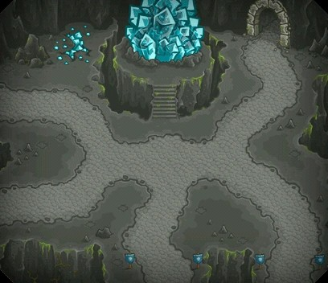
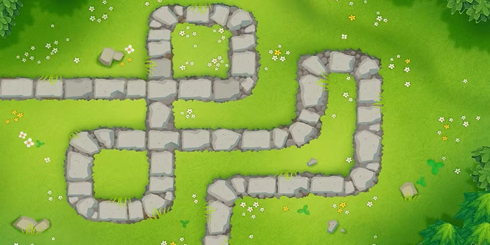
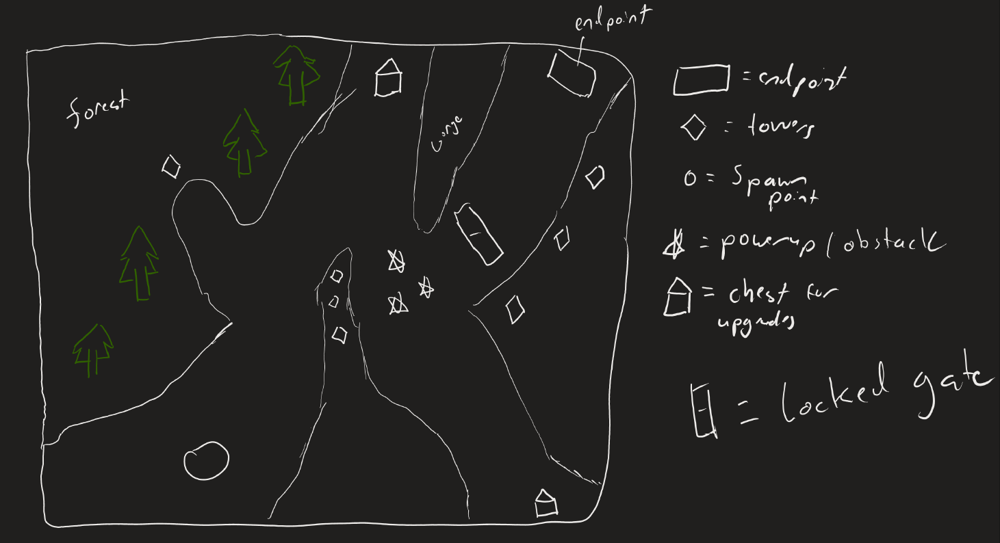
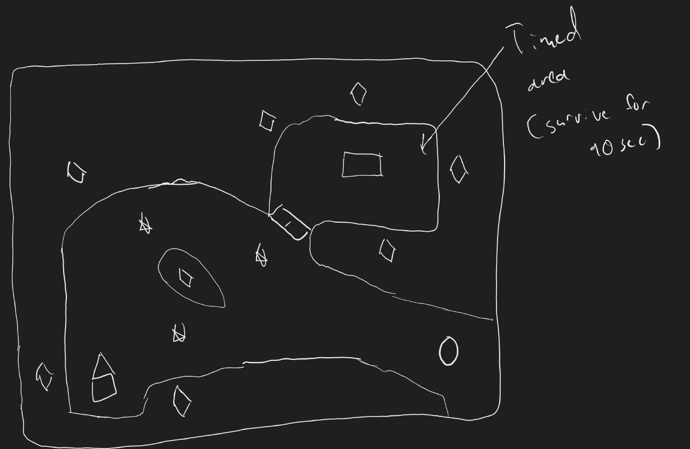
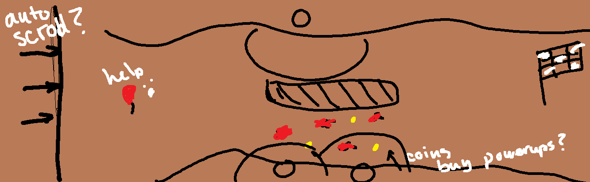
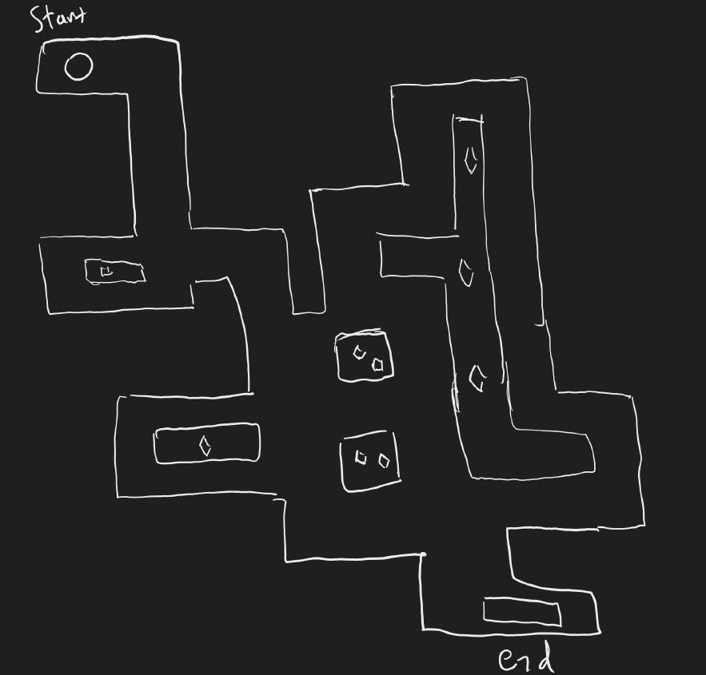
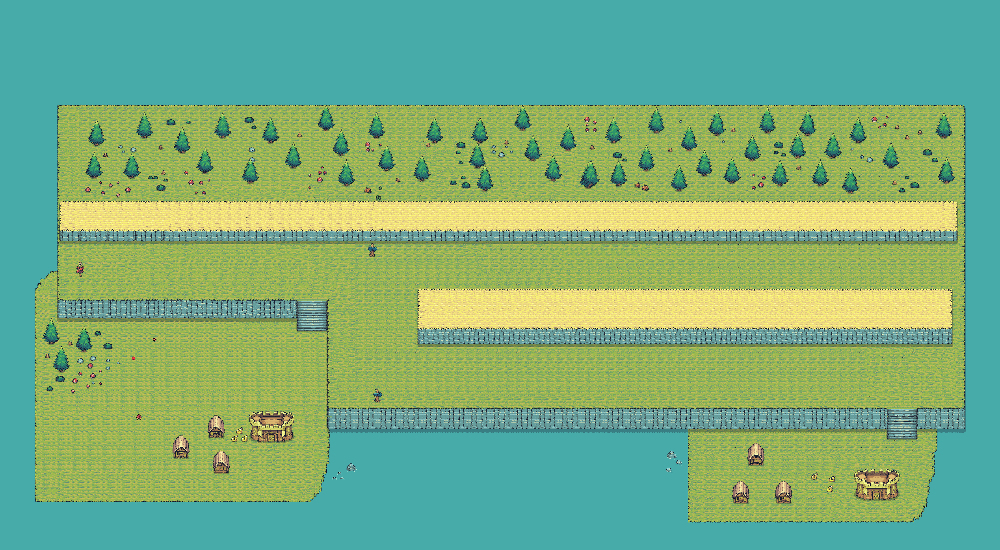
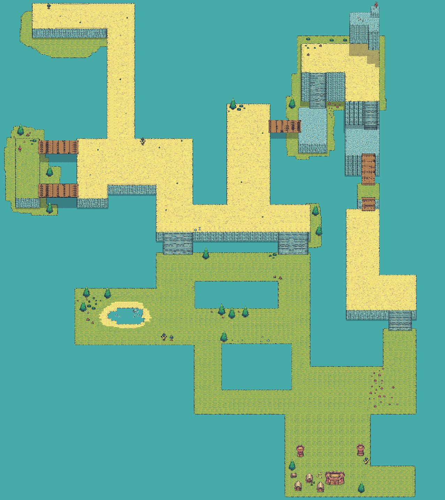
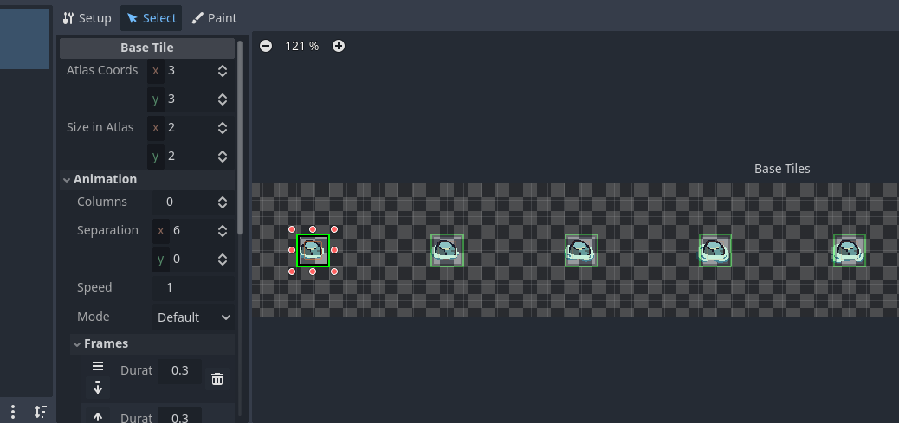

# Monkey Trench Offense #

## Summary ##

In our game you play as a balloon trying to escape evil monkeys that have trapped you and your fellow balloons. You must dodge the projectile attacks from numerous monkeys like bomb monkeys that throw TNT with huge explosions at you, dart monkeys that throw multiple needle sharp darts, and ice monkeys that hurl freezing icicles. With no ability to fight back, your only options are to run, dash, and outmaneuver the relentless attacks. The further you progress, the more challenging the enemies and obstacles become as you strive for freedom. There are special abilities you must use to overcome the oppression of the monkeys.

## Project Resources

[Web-playable version of your game.](https://itch.io/)  
[Trailer](https://youtu.be/i8l6JdhSNFc?si=5tn6Pdlufj88c8pC)  
[Press Kit](https://ryanffrench.github.io/MonkeyTrenchOffense-PressKit/)  
[Proposal](https://docs.google.com/document/d/1XfRfDoN-Fm2vW_cJ7vQpI7-b4w9EeZ0zoOBdrwvnYzk/edit?tab=t.0#heading=h.i3tv2mxf7h7z)  

## Gameplay Explanation ##

Your goal is to dodge projectiles and obstacles as you navigate through the levels to reach freedom. The controls are simple:

## Controls:
- **Arrow Keys / WASD**: Use these keys to move your balloon in any direction. 
  - **Up / W**: Move Up
  - **Down / S**: Move Down
  - **Left / A**: Move Left
  - **Right / D**: Move Right
- **Spacebar**: Use the spacebar to dash quickly in the direction you're moving. This will help you evade incoming attacks, but use it wisely, as the dash has a cooldown period.
- **P**: Use to Activate Black-Hole Bloon's Absorption Ability 
- **E**: Cycle Through Upgrades (Only Available When Cheat Mode is On, Toggleable In Main Menu)
  
## Gameplay Strategy:
1. **Dodge and Dash**: Your main defense is your ability to move and dash. Keep an eye on the approaching enemies and their projectiles. Time your dash carefully to avoid explosions, arrows, and icicles.
2. **Enemy Patterns**: Different monkeys throw different types of projectiles, each with its own behavior. Bomb monkeys will throw large TNT that explode after a short delay, dart monkeys will shoot fast arrows in predictable patterns, and ice monkeys will throw icicles that slow you down. Learn their patterns and use your dash strategically to evade them.
3. **Positioning**: Always keep an eye on the terrain and use it to your advantage. Some areas may provide more room to maneuver, while others might be more dangerous due to tight spaces and numerous enemies.
4. **Use the Dash Sparingly**: The dash is a powerful tool, but it has a cooldown period. Use it when you absolutely need to escape or quickly change direction. Overusing it may leave you vulnerable.
5. **Level Progression**: Each level gets progressively more difficult with additional enemies and faster projectiles. Stay alert and adapt your strategy as the challenges increase.
6. **Collect Special Powerups**: There are powerup coins in each level that grant you the choice between 3 unique powerups: Beast Bloon, Lead Bloon, and Black-Hole Bloon. The Beast Bloon boasts an unbeatable movement speed and no dash cooldown, so you can rush past any towers but it is easily popped by any projectile. The Lead Bloon's thick meal exterior can tank many hits from sharp projectiles so as long as there is no bomb nearby you'll be just fine, but beware that this bloon is weighed down and thus slower. The Black-Hole Bloon grants you a unique absorption ability that will absorb any projectile for 5 seconds and regenerates your lost health for each projectile absorbed up to max health, but it will go on cooldown for 10 seconds after and force you to stop as the bloon 'digests' the projectiles for 3 seconds after the ability is finished. You will need specific abilities to overcome certain level sections, so choose wisely!
   
Good luck, and may you escape the monkeys’ clutches!

**Add it here if you did work that should be factored into your grade but does not fit easily into the prescribed roles! Please include links to resources and descriptions of game-related material that does not fit into roles here.**
- Our main roles and subroles that we ended up working on throughout the project development differ somewhat from what this template lays out since we felt for our game there was a different way to split the work fairly with the highest efficiency and structure. 
Our Main roles and Subroles were as follows:
Eugene Cho - Main Role: Map Design/Level Design, Subrole: Level Feel
Ben Young - Main Role: Movement/Physics, Subrole: Gameplay Feel
Minji Yun - Main Role: Animation/Visuals, Subrole: Narrative Design
Ryan Ffrench - Main Role: Producer, Subrole: Audio/SFX & Presskit/Trailer (Chose two subroles since the main role was a little lighter)
Nathan Kotni - Main Role: Tower/Bloon Upgrades Planning & Powerups Coding, Subrole: Menu/GUI
Richard Shi - Main Role: Entity/Tower Programming, Subrole: Gameplay Testing
*NOTE: Obviously, it would be a little ridiculous to say that each person only contributed to their own role and subrole, there was a lot of collaboration and overlap between roles but it is roughly true that each person contributed more to their listed role than any others. 

# External Code, Ideas, and Structure #

- The intellectual guidance we used was more along the lines of the idea for our game coming from a unique twist on an established and well known game, Bloons Tower Defense, which is apparent from our game title intentially being an inverse of it. We definitely did have many unique elements to our game like the format not being a tower defense game at all since you are playing as the Bloon now it is akin to a Bullet Hell style game or even a Dungeon Crawler to an extent, and we also implemented some of our own unique powerups like the Beast Bloon and Black-Hole Bloon, so there was definitely independent thinking put into the game while using BTD as a baseline.
- We looked at the Godot documentation for guidance in how to implement our vision for the game in code and consulted online forums like Reddit, Stack Exchange, and the Godot Forums for debugging difficult errors that arose (usually through Google searching the error message).

# Main Roles #

Your goal is to relate the work of your role and sub-role in terms of the content of the course. Please look at the role sections below for specific instructions for each role.

Below is a template for you to highlight items of your work. These provide the evidence needed for your work to be evaluated. Try to have at least four such descriptions. They will be assessed on the quality of the underlying system and how they are linked to course content. 

*Short Description* - Long description of your work item that includes how it is relevant to topics discussed in class. [link to evidence in your repository](https://github.com/dr-jam/ECS189L/edit/project-description/ProjectDocumentTemplate.md)

Here is an example:  
*Procedural Terrain* - The game's background consists of procedurally generated terrain produced with Perlin noise. The game can modify this terrain at run-time via a call to its script methods. The intent is to allow the player to modify the terrain. This system is based on the component design pattern and the procedural content generation portions of the course. [The PCG terrain generation script](https://github.com/dr-jam/CameraControlExercise/blob/513b927e87fc686fe627bf7d4ff6ff841cf34e9f/Obscura/Assets/Scripts/TerrainGenerator.cs#L6).

You should replay any **bold text** with your relevant information. Liberally use the template when necessary and appropriate.

## Producer - Ryan Ffrench

My group was amazing which made my role as a producer go smoothly. We came up with an idea that is simple to understand, and allowed us to easily come to a consensus on what our game should look and feel like. One of the judges at the game jam even said that it was smart we made a game that was a spin on a preexisting game because so many design decisions had already been made. We were behind going into the first progress report, but this was due to it being Thanksgiving. Understandably people did not get as much work done over this time period as expected. I ensured everyone was on track by checking in with the group in a team group chat. Communication was great. When people had bugs or other issues the entire group did their best to help. The biggest issue we faced as a group was issues with Godot's (nonexistent) Git integration specifically with merge conflicts. We minimized this by using pull requests/different branches initially, and later by pushing only when a significant amount of work had been done and with warning to the rest of the team. I specifically commited my changes late at night with hours of advanced notice. Another notable thing I did was formulate a good quick pitch for our project and come up with a way to present our game in an engaing way that showed off its strengths during the Final Festival. 

## Entity Programming - Richard Shi
My role was to lay the groundwork and code the foundational behaviors and organizational hierarchy of the three main types of entities in our game: player, towers, and projectiles. Parts of these were later expanded upon by other team members working on specific systems that rely on first having basic functional entities (eg. upgrades, movement physics, sound, etc.). See commit history of richardBranch and main for details.

*Player:* The first thing I coded was a [player entity](https://github.com/Echo108471/MonkeyTrenchOffense/blob/9d3d79b015ef8b90aad342d511616c91e4f7395c/monkeytrenchoffense/Scenes/player/player.gd#L1) that had all the basic properties of a collision hull, hitbox (or is called a hurtbox???), sprite, basic movement physics (later overwritten and improved by team), health, etc. I implemented a framework for communicating damage and status effects to the player and implemented a basic slowdown effect from the slow tower. Regrettably, given the scope of the game and available time, this was not used to its fullest extent. This part of my role had the most significant overlap with other team members' work since the game is so heavily centered around the player entity and so many later additions, such as sound or game feel or ui, directly built on it.

*Towers:* I created a [base tower class](https://github.com/Echo108471/MonkeyTrenchOffense/blob/9d3d79b015ef8b90aad342d511616c91e4f7395c/monkeytrenchoffense/Scenes/turrets/turretBase/turret_base.gd#L1) and scene from which the others are derived. The three types of towers ([projectile](https://github.com/Echo108471/MonkeyTrenchOffense/blob/9d3d79b015ef8b90aad342d511616c91e4f7395c/monkeytrenchoffense/Scenes/turrets/projectileTurret/projectileTurret.gd#L1), [slow](https://github.com/Echo108471/MonkeyTrenchOffense/blob/9d3d79b015ef8b90aad342d511616c91e4f7395c/monkeytrenchoffense/Scenes/turrets/slowTurret/slowTurret.gd#L1), and [bomb](https://github.com/Echo108471/MonkeyTrenchOffense/blob/9d3d79b015ef8b90aad342d511616c91e4f7395c/monkeytrenchoffense/Scenes/turrets/bombTurret/bombTurret.gd#L1)) all inherit the core properties of a tower from this parent class (most represented by a list of member variables that can be customized as needed by other game systems such as tower upgrades). This part of my role had relatively notable overlap with other team members given that other systems would need to use/alter behavior of the towers through member variables. Additional note: the vector math for making the projectile turret's customizable spreadshot was particularly challenging when I began to consider making it as robust a solution as possible.

*Projectiles:* I first created a [basic bullet](https://github.com/Echo108471/MonkeyTrenchOffense/blob/9d3d79b015ef8b90aad342d511616c91e4f7395c/monkeytrenchoffense/Scenes/projectiles/bulletBase.gd#L1) to serve as reference. It has the basic functionality of aiming, flying, seeking, damaging, etc. and other such basic behaviors for a projectile. The [bomb bullet](https://github.com/Echo108471/MonkeyTrenchOffense/blob/9d3d79b015ef8b90aad342d511616c91e4f7395c/monkeytrenchoffense/Scenes/projectiles/bulletBomb.gd#L1) inherits from it, though adding/altering timers, signals, the hitbox, and fuse/explosion animations in order to make it blow up in addition to just flying forward like a normal projectile. Also, another team member later helped create a separate icicle bullet using the basic bullet as a template, although in hindsight a more elegant implementation would have been to simply initialize and configure it with a different sprite instead of making a whole new class. This part of my role had relatively little overlap with other team members given that most information would be passed through the turret when calling the configure function.

## User Interface and Input

**Describe your user interface and how it relates to gameplay. This can be done via the template.**
**Describe the default input configuration.**

**Add an entry for each platform or input style your project supports.**

## Movement/Physics -- Ben Young

*Movement* - While I was designing the movement system, I tried to balance control versus fluidity. In a bullethell-esque game, controlling your character to avoid projectiles is really important. In some games, your character moves exactly with your inputs and carries no momentum. In other games, unwieldy movement mechanics **are** the challenge, like ice levels in platformers or games like QWOP where the player is a floppy mess. For this game, I wanted the movement 

The main idea behind our movement system is _"floaty"_-ness to mimic the feeling of a balloon. To implement this idea I created a 2nd order movement system in [_handle_movement_inputs](https://github.com/Echo108471/MonkeyTrenchOffense/blob/2e86806a0769620226b464a5874b5285bddb5dd5/monkeytrenchoffense/Scenes/player/player.gd#L106): Player inputs create an acceleration, which increments velocity, which finally increments the player's position using Godot's built-in **move_and_slide** function. When there are no inputs, there is a _drag_ acceleration which slowly brings the player to stop.

Using the built-in **move_and_slide** saved a ton of headache implementing collision checks and handling, as this function simply adds the objects velocity to its position, checks for collisions several times along the way, and does a simple collision handling which redirects the players velocity along the collision point. One drawback of using this function is that the player can actually move faster by pressing diagonally against the wall, as the orthagonal component of their velocity is added to the parallel component. Ideally, the player would not be encouraged to press as hard against every wall as they can, although it adds an interesting wrinkle to the map design.

Because our game's player has no attack, movement is the only option to deal with enemy fire. To help the player avoid enemy attacks, they have access to a dash using the space key. This dash gives a burst of speed, and can help accelerate the player to full speed faster, but comes with a cost. After the dash, the player is slowed for a small amount of time while they recover. The risk/reward aspect of this mechanic makes engaging with turrets fun.  

*Power up integration with player* - The base movement mechanics are further supplemented through the game's powerups in [apply_power_up](https://github.com/Echo108471/MonkeyTrenchOffense/blob/ab6c1c7dbcd23f790b4e8def95486a48109ecc82/monkeytrenchoffense/Scenes/player/player.gd#L148), which modify attributes of the player. For example, the _beast_ powerup greatly increases the players movement speed and dash duration, and decreases the dash recovery period. These attributes are designed to be easily modifiable, and are relative to each other. The dash speed is set as a multiplier of the maximum movement speed, so that you don't accidentally end up with a dash slower than the movement speed if you forget to increase the dash multiplier.

Using the assets created by Minji, I also implemented some of the animation spritesheets and animation switching code within this function. 

The enemy's can affect the player's movement speed as well. The ice turrets add a [negative multiplier](https://github.com/Echo108471/MonkeyTrenchOffense/blob/ab6c1c7dbcd23f790b4e8def95486a48109ecc82/monkeytrenchoffense/Scenes/player/player.gd#L100) to the player's speed, which is factored in after the players intrinsic movement multipliers so that they always stack correctly.

## Animation and Visuals -- Minji Yun

**List your assets, including their sources and licenses.**
Assets Used:
- Map Tiles, small animations, decorations: [Tiny Swords](https://pixelfrog-assets.itch.io/tiny-swords) - Creative Commons Zero License
*Inspiration Taken From BTD Games

- Created character visuals and sprite sheets. Animated them using animation tree and animation player.
- Visual components:
  - All visuals were created using Procreate
  - Player - Balloon (6 variations)
  - Towers - Monkeys (3 variations)
  - Projectiles - Darts (2 variations)
  - Start menu background, defeat/win screen
  - Nail trap (ended up not using)
- Character animation descriptions:
  - Balloons:
    - Idle: All balloons have a simple floating animation that bobs up and down.
    - Beast Balloon: It has a shiny particle appearing and disappearing effect to give it a reflective metalice feel
    - Lead Balloon: It has metal spikes shooting out and disappearing after it gets hit by a sharp projectile
    - Black hole Balloon: Its core is in the middle and there’s a purple aura swirling around
    - Each balloon animation has at least 5 frames
    - Popping effect on death: 15 frames, only shows red balloon since that is the last balloon state after downgrading from taking damage
  - Monkeys:
    - Idle: They are not moving when the player is not inside the detection radius. They only activate once the player steps in
    - Active: They move their right hands up and down, giving it a throwing motion
  - Projectile:
    - They have no animation, only static visual since it’s already flying straight out
    - Regular dart and icicle
- All visuals are original, no licenses. I painted them one by one, frame by frame. Lead Balloon, Beast Balloon, and Black Hole Balloon designs made by Nathan (Upgrades Planner).
- Balloons:

- Monkeys:

- Projectiles:

- Start/Win/Lose Screen

## Map and Level Design (Eugene Cho)

### Initial Design
When I was first thinking about the level and map design, I first thought about what kind of level I wanted to design. The theme of our game is to escape a bunch of monkey towers as a balloon, with special abilities. Due to this reversal of the genre, while there are many examples of high-quality tower defense games, such as the Bloons TD games as well as the Kingdom Rush games, many of the map layouts and game design choices, while brilliant for the tower defense genre, are not as applicable in our game, which favors player movement and choice. Especially the Kingdom Rush series, I really admired the creators, Ironhide Games, for their level design. However, design choices such as having multiple branching paths with different spawn points of enemies make for a much more engaging tower defense game, but not so much a reverse tower defense.

Here are some examples of BTD and Kingdom Rush maps below:

Due to this, I began searching through other genres for maps, focusing on games and genres that emphasized movement and map design focused on a single entity. I found inspiration for maps in another one of Ironhide's games, a mobile-focused RTS called *Iron Marines*. *Iron Marines* is unique for an RTS—it’s a single-player campaign-only game, and due to its identity as a mobile-focused game, the design of the levels leans more towards strategic location and map design rather than actions per minute (APM).

Some of my first map designs looked like this:

While these were interesting initial designs, the team felt they diverged too far from the original idea of a trench escape game and leaned too much towards a dungeon-crawler-like design. So, including one design that a teammate came up with, I created two levels: one as a simple introductory level to guide the player through the mechanics of the game, and another more complex, mazelike map intended for players to explore on consecutive attempts.

Initial Designs:

Final Maps:

**Map 1:** The first map was intended to be a beginner level one, with only two split paths, with varying difficulty for each path. The goal is to make a simple, easy to understand goal for the player: get from the start to the end without dying. The entire map is made with a single asset package, called "tiny swords" which is linked in the asset sections of this page. Additionally, I intended the towns to act as a checkpoint for the player, allowing them to heal or buy upgrades to act as a progression system for the player. Decoration wise, I organized the map into a forested area near the top as a form of decoration and scenery. Initially, the intention was to create another path at the top of the map as well, but the layout wasn't working out, so I decided to go with simplicity. Decoration wise, I additionally added two signs into each of the paths to indicate the player in the correct direction, as well as a X sign near the end of the map if the player decides to start going the opposite direction. While these are small details that are likely to go unnoticed, I believe that they tie into guiding the player in the correct direction.

**Map 2:** The second map is much larger and more complex. With more experience after designing the first map, I was able to organize the layout and save time. The design emphasizes a maze-like structure, offering players multiple paths with varying difficulty. I also aimed to create the impression of different biomes on the map. The biomes include:
- **Desert biome:** The starting area, with sparse plants and a barren plain.
- **Cliff biome:** A region representing cliffs by the ocean.
- **Mountain biome:** A higher elevation area meant to serve as a high mountaintop
- **Valley biome:** The bottom of the map, reflecting a valley featuring lakes, wildlife, and a town at the very end.

Additionally, on this map I created a dedicated physics layer to draw out the bounds of the entire tilemap. In my previous map, I achieved it by automatically marking outer tiles as physics layers, but I found that having a dedicated tilemaplayer for physics was nice and made it much easier to debug. There is not as much intention behind the decorations, but I did choose certain decorations to be more memorable for the player to remember. Instead of making a bunch of trees scattered around for example, I created a mushroom patch near the bottom right of the map to serve aesthetic and almost as a mental checkpoint.

---

### Technical Components

These maps were created using a tileset from an asset pack called *Tiny Swords* to construct a tilemap in Godot. The `TileMapLayer` node was used to design the map layers, allowing for the stacking of multiple layers to create depth and structure. For example, by layering specific tiles (like walls, grass, and objects) on different `TileMapLayer` nodes, you can simulate visual depth and proper overlap for structures and environmental features. This technique is essential for creating a polished look in 2D maps, where different parts of the scene need to interact visually, such as stairs and shadows.

Notably, the original `TileMap` node in Godot was deprecated about three months ago as part of an update. This update introduced the `TileMapLayer` node, which added new functionality for managing multiple layers within a single tilemap structure. However, this change created challenges for the project: much of the information available online was outdated and inconsistent, as many tutorials and resources still referenced the old `TileMap` workflow. As a result, learning how to properly implement the new system required additional time and experimentation to align with the updated documentation.

Part of the way through development, I started using a tool called the autotiler. The autotiler is a feature in Godot that simplifies the tile placement process by automatically connecting and aligning tiles based on predefined rules. For example, when creating terrain like grass, paths, or walls, the autotiler can determine which tile variant to use (e.g., corners, edges, or center pieces) without requiring manual selection for each placement. This tool is very helpful for drawing tilemaps, and significantly reduced the time required to align specific squares to each other. However, while functional, my tilemap did not work super well until Ben, a member on my team helped me realize that the tile size needs to be the size of the entire tile.

For animations, Godot has a way to create an animation tilemap, where by creating individual tiles to every single frame and setting a time period to each frame, you can create an animation with a tileset and add moving scenery into the layer

Finally, for my physics layer, I implemented it by creating a new independent `TileMapLayer` solely focused on defining the physics boundaries. Previously, I defined physics boundaries by assigning them to every border tile in the tileset. While functional, this approach becomes tedious for larger maps and layers. Exceptions (e.g., where players can cross certain borders) are also harder to handle. By creating a dedicated boundary layer, I simplified the process for defining the play space and made debugging more efficient.

## Game Logic

**Document the game states and game data you managed and the design patterns you used to complete your task.**

# Sub-Roles

## Audio -- Ryan Ffrench

**List your assets, including their sources and licenses.**
Game Music: "[Mystic Forest](https://youtu.be/sSmseFKxw1I?si=59ohjdtooL_0dEvV)" By HeatleyBros - Free for non commercial use
Title Screen Music: "[8 Bit Beginning](https://www.youtube.com/watch?v=ptlYSrZU_ZU&list=LL&index=2)" By HeatleyBros - Free for non comercial use
Game Over Music: "[8 Bit Evil](https://www.youtube.com/watch?v=sVCeqYmRwJ0&list=LL&index=3)" By HeatleyBros - Free for non comercial use
Game Win Music: "[Level Up Theme Song](https://www.youtube.com/watch?v=TiE9Vvmlxew&list=LL&index=4)" By HeatleyBros - Free for non comercial use
Dart Monkey Sound: "[Dart Sound Effects](https://www.youtube.com/watch?v=FqLYIUOYVgw)" By Sound Effects Store - Copyright Free
Lead Balloon Hit: "[Bullet Hits Metal Ricochet Free Sound Effects](https://www.youtube.com/watch?v=1QUcxXGGRPA&list=LL&index=7)" By Isolation Music - Copyright Free
Balloon Hit: "[Balloon rubbing with hands sound effect stereo HQ 96kHz](https://www.youtube.com/watch?v=Z5EKTfx0GdE&list=LL&index=5)" By Picture to Sound  - Copyright Free
Slow Zone: "[Pop Sound Effects](https://www.youtube.com/watch?v=BYPqS0YPxh8) By Creator Assets - Copyright Free
Bomb Explosion: "[8-Bit Explosion Sound Effects](https://www.youtube.com/watch?v=EA4h8l2zZ1g&list=LL&index=1)" By Creator Assets - Copyright Free
Bomb Fuse: "[Hot Sizzling Sound Effect](https://www.youtube.com/watch?v=viVDNzFZ0GE&list=LL&index=2)" By copyright free sound-effect - Copyright Free
Dash: "[Wind Sound FX](https://www.youtube.com/watch?v=KwGYAfh0K3w)" By Sound FX - Copyright Free
Balloon Pop: "[Balloon Pop Sound Effect](https://www.youtube.com/watch?v=W6dIocG78U8) By Sound Effects Download - Copyright Free
Collectible: "[8-Bit Powerup Sound Effects](https://www.youtube.com/watch?v=SoZhpnTuQBo)" By Creator Assets - Copyright Free

**Describe the implementation of your audio system.**
Implementing the audio system for the game was harder and more time consuming than it should have been. I initially had an audio system using signals and a SoundManager class similar to exercise #3, but baffling errors resulted in me pivoting to a scene based implementation where every scene has relevant audio nodes attatched. I added a large number of sound effects and a few music tracks. I made sure to pay attention to small details like having a different damage sound when the player is the lead balloon. As for creation, I primarly downloaded royalty free SFX and music tracks I liked from Youtube, and modified them in Audacity.

**Document the sound style.** 
Sound effects are important to our gameplay. If a player cannot hear the projectiles being thrown at them it is much harder to avoid them. With this in mind I designed the sound effects to be distinct from each other so that each tower had its own sound profile. I also picked background music that is more ambient and mellow, so the sound effects are not drowned out. For the soundfont I was inspired by an indie game I like called Golf Story. It has mostly chiptune music, but regular SFX which helps the SFX have contrast with the music.

## Gameplay Testing - Richard Shi

Due to the tight schedule, our game was not in a state to gather meaningful feedback during the GDAC event. Consequently, I collected feedback from a number of friends, classmates, and roommates during the development process, which contributed to many changes that made their way into the game.

Listed below are some of the most prominent feedback with visible effects on the final product:

Janky movement: Early feedback commented on the "janky" feeling of player movement, mostly while using my initial unrefined movement physics and early iterations of the current system. Consequently, much attention went into the acceleration/decceleration of the player, dash speed and cooldowns, etc. in order to create a player entity that felt like an extension of the player. The presence of a team member dedicated primarily to handling the movement behaviors of the player proved highly valuable.

Screen size: One problem we had was towers shooting from far off-screen, which eventually led to a full readjustment of entity scales across the board once the maps were largely finished and proper testing around the levels could begin. Initial settings were too zoomed in and various entities (namely some towers compared to the player) were disproportionate in size, which has since been adjusted significantly. Things look mostly proportional now.

Tower range visibility: An early complaint that went hand in hand with the screen size issue was the uncertainty of tower range. Once visible debug collision shapes were turned off, there was no clear indicator of being within range of a tower other than it swivelling to face the player, or simply being shot by the tower. As a result, I added a visible dark gray circle around towers, scaled to the size of their range, as an indicator. Further feedback prompted me to make the range indicators only appear once the player entered the range of a tower so as to remove clutter from the screen and not give away off-screen towers too much.

Lack of UI: An early complaint was that the game lacked any kind of UI or end screen (since the game simply quit on death during early development). This has since been alleviated by the introduction of UI and an end screen and no longer quitting on death.

Bomb telegraphing: The bomb tower is particularly devastating due to its unique AOE attack, which led to feedback requesting clearer telegraphing. The initial bomb projectile had poor indication of its explosion behavior. This has since been fixed by two measures. First, I refined the timing of the hitboxes for the explosion to more closely match the visible animation. Second, I added an animated pointlight2d to the bomb which burns down the length of the fuse prior to detonation. This latter effect is subtle but was received positively by those who broached the feedback. Together these two changes made the bomb tower much easier to read for players.

Getting stuck: Some locations, such as parts of the far right side of map1, had certain gaps that made it possible to get stuck. Small map adjustments and later placements of finishing points and towers made these issue significantly less pressing.

Hitbox size: Initially, the player's hitbox and collision hull were both scaled exactly to the size of the balloon sprite. However, in practice, this led to the feedback of being unfairly hit by certain projectiles. As a result, there was work in scaling down these boxes in order to improved the perceived fairness of hitreg.

## Narrative Design -- Minji Yun
- After thorough discussion with the team members, we decided to take the classic Bloons TD and put a spin on it. Now the player is the balloon and the towers are monkeys. We also decided to go with non-pixelated, smooth visuals, as Bloons TD does the same.
- Characters:
  - Balloons: Red, Blue, Green, Beast, Lead, Black Hole
  - Monkeys: Multishot, Ice, TNT
- Each monkey type has different tails. Normal monkey has an initial M in its tail, Ice monkey has an initial I in its tail, TNT monkey has TNT in its tail.
  - TNT monkey is holding a TNT on its left hand to give it a more unique look.
  - Normal monkey has the default monkey color, Ice monkey is blue, TNT monkey is red.
- Base storyline/Ideas behind the game:
  - The original Bloons TD is described from the monkeys' point of view, and sees the balloons as mere poppable objects. We wanted to deliver how scary that game situation is in balloons’ point of view. 
  - The monkeys are mad at the balloon, and the balloon has to escape with some help from upgrade items and extra layers given for itself.
  - The start menu screen suggests that there is an active war, while also portraying how perplexed the balloon feels about the situation. The tension is strong.
  - Win screen: The balloon is happy that it escaped successfully.
  - Defeat screen: The dart popped the balloon and it deflated due to that. There is a  monkey grim reaper standing near, waiting to take the balloon’s soul with them.
- Message behind the game:
  - Don’t mess with the monkeys!

## Press Kit and Trailer -- Ryan Ffrench

**Include links to your presskit materials and trailer.**

**Describe how you showcased your work. How did you choose what to show in the trailer? Why did you choose your screenshots?**
For the screenshots and the trailer, I chose the parts of the game that are the coolest. Specifically, I made sure to show off the Bomb Monkey and Ice Monkey. I tried to go for an over the top funny editing style, because it fits with our game well.

## Game Feel and Polish

**Document what you added to and how you tweaked your game to improve its game feel.**
### Ben Young

*Bomb Tower "launching"* - Using a bezier curve (found in [GDscript documentation](https://docs.godotengine.org/en/stable/tutorials/math/beziers_and_curves.html)), I was able to simulate a parabolic trajectory for the bomb projectile, [adjusting the scale](https://github.com/Echo108471/MonkeyTrenchOffense/blob/ab6c1c7dbcd23f790b4e8def95486a48109ecc82/monkeytrenchoffense/Scenes/projectiles/bulletBomb.gd#L21) of the sprite to simulate depth in our otherwise 2D game. I also adjusted the movement of the projectile so that it targets the player's position, rather than flying in the direction of the player for a set amount of time, which often resulted in the bomb missing the player completely. This change differentiated the bomb tower and made it more threatening to the player.

*Reducing Player hurtbox* - In many bullet hell games, or even platformers, the characters hurtbox is significantly smaller than the sprite would make it seem. This is to minimize the risk of "how did that hit me ?!" moments, and increase the "phew, can't believe I made it!" moments. Because it's just a singleplayer game, fairness is not really a concern, so it's best to err in the favor of the player. In some games, the hurtbox is as small as a single pixel. For our game, I adjusted it to be about half the size of the sprite, to have some fairness but not confuse the player with projectiles passing right through them.  

*Code improvements* - I tweaked many features in the code of our game to make it more extensible and easier to integrate with new features. For the turrets and projectiles, I adjusted the OOP framework setup by Richard to give more power to the base class, and reduce the amount of repeated code in the subclasses (used above for the launching animation for example). This helped during development a lot as there was often changes which should apply to all subclasses. I also set up the scene defaults to make use of [Godot's export tag](https://github.com/Echo108471/MonkeyTrenchOffense/blob/ab6c1c7dbcd23f790b4e8def95486a48109ecc82/monkeytrenchoffense/Scenes/turrets/turretBase/turret_base.gd#L6), which exposes scene properties inside the editor. This was important for our game since we have many copies of each tower which we may want to adjust individually, rather than applying the same properties to all instances of that scene.

*Map improvements* - I was able to reconfigure the TileMap we had implemented to properly reflect the size of our tile assets, which made the workflow much smoother and consistent. Without the proper tile size, the textures do not tile and there is visible edges between subtiles. This is a tradeoff however, as Eugene was able to make some awesome maps using these smaller subtiles which is not possible using full sized tiles    

In general, scripts became much shorter by removing duplicated code, increasing the density of meaningful code which helps make changes faster. 

## Level Feel (Eugene Cho)

To enhance the level feel of the game, I developed several power-ups and obstacles that players can encounter while traversing the map. These elements aim to add dynamic gameplay interactions and create variety in the player experience.

### 1. **Speed Coin**

The **Speed Coin** is a power-up that temporarily increases the player's movement speed upon collection. It incentivizes exploration and rewards players for venturing into certain areas of the map. The script works by creating a simple one shot timer that multiplies `player.movement_speed` - the maximum movement speed by a certain amount until the timer ends, where the player speed boost is removed and the node then deleted. Notably, while the speed boost is active, the node just turns invisible, and deletes itself at the end of the timer to avoid giving the player an infinite speed boost.

- **Scripts**:

  - [Speed Coin `.gd` file](https://github.com/Echo108471/MonkeyTrenchOffense/blob/main/monkeytrenchoffense/Scenes/projectiles/power_up_coin.gd)

- **Scene**:

  - [Speed Coin `.tscn` file](https://github.com/Echo108471/MonkeyTrenchOffense/blob/main/monkeytrenchoffense/Scenes/projectiles/power_up_coin.tscn)

---

### 2. **Slow Area**

The **Slow Area** is an obstacle that reduces the player's movement speed when they enter its range. This mechanic introduces strategic planning to avoid slowing down in critical moments, adding a layer of challenge to navigation. The slow area works very similarly to the speed boost coin, where instead of speeding, it slows down the player whenever they enter the `Area2D`.

- **Scripts**:

  - [Slow Area `.gd` file](https://github.com/Echo108471/MonkeyTrenchOffense/blob/main/monkeytrenchoffense/Scenes/projectiles/slow_area.gd)

- **Scene**:

  - [Slow Area `.tscn` file](https://github.com/Echo108471/MonkeyTrenchOffense/blob/main/monkeytrenchoffense/Scenes/projectiles/slow_area.tscn)

---

### 3. **TNT**

The **TNT** obstacle is an explosive hazard that can explode and damage the player after a countdown if a player comes near. It adds tension and forces careful movement in areas where TNT is placed. The TNT is a simple one shot timer, that starts when the player enters a certain area around the TNT. After the timer is over, the TNT calculates the distance from the player, and if the distance is within a certain amount, the player receives damage.

- **Scripts**:

  - [TNT `.gd` file](https://github.com/Echo108471/MonkeyTrenchOffense/blob/main/monkeytrenchoffense/Scenes/projectiles/tnt.gd)

- **Scene**:

  - [TNT `.tscn` file](https://github.com/Echo108471/MonkeyTrenchOffense/blob/main/monkeytrenchoffense/Scenes/projectiles/tnt.tscn)

---

### 4. **Map Teleporter**

I additionally implemented a map teleporter that teleports the player automatically to the next stage when the player enters a certain zone. This works almost exactly like the cutscene starter from the command exercise, where the player is automatically teleported to a certain position.

- **Scripts**:

  - [second_level_trigger `.gd` file](https://github.com/Echo108471/MonkeyTrenchOffense/blob/main/monkeytrenchoffense/Scripts/second_level_trigger.gd)

